# PideAqui — Arquitectura del Backend (Diagramas)

> Documentación visual generada por análisis directo del código fuente.
> Todos los diagramas están en formato **Mermaid** para visualización en GitHub, VS Code, o cualquier herramienta compatible.

---

## Índice

1. [Vista General de la Arquitectura](#1-vista-general-de-la-arquitectura)
2. [Diagrama de Entidad-Relación (Modelos Eloquent)](#2-diagrama-de-entidad-relación)
3. [Mapa de Rutas — Admin Web](#3-mapa-de-rutas--admin-web)
4. [Mapa de Rutas — API Pública](#4-mapa-de-rutas--api-pública)
5. [Mapa de Rutas — SuperAdmin](#5-mapa-de-rutas--superadmin)
6. [Ciclo de Vida de una Petición HTTP](#6-ciclo-de-vida-de-una-petición-http)
7. [Flujo: Creación de Pedido (API)](#7-flujo-creación-de-pedido-api)
8. [Flujo: Cálculo de Delivery](#8-flujo-cálculo-de-delivery)
9. [Flujo: Admin — Kanban de Pedidos](#9-flujo-admin--kanban-de-pedidos)
10. [Capa de Servicios](#10-capa-de-servicios)
11. [Sistema de Multi-Tenancy](#11-sistema-de-multi-tenancy)
12. [Middleware y Guards](#12-middleware-y-guards)
13. [Descripción de Componentes](#13-descripción-de-componentes)

---

## 1. Vista General de la Arquitectura

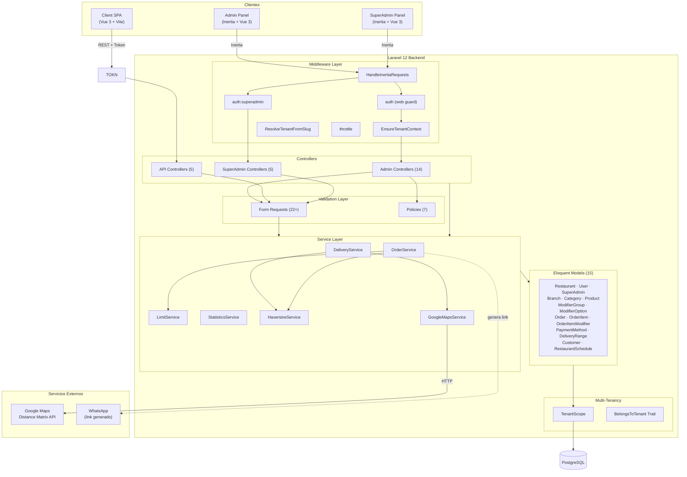

---

## 2. Diagrama de Entidad-Relación

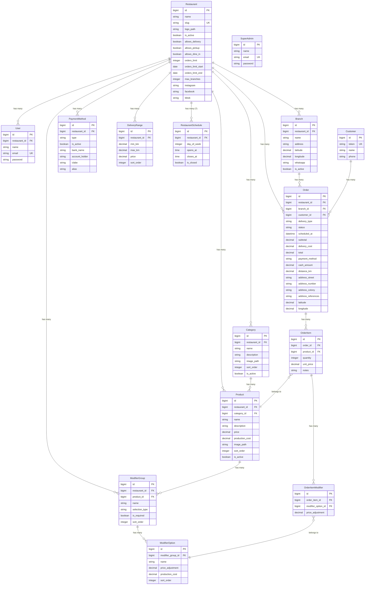

---

## 3. Mapa de Rutas — Admin Web

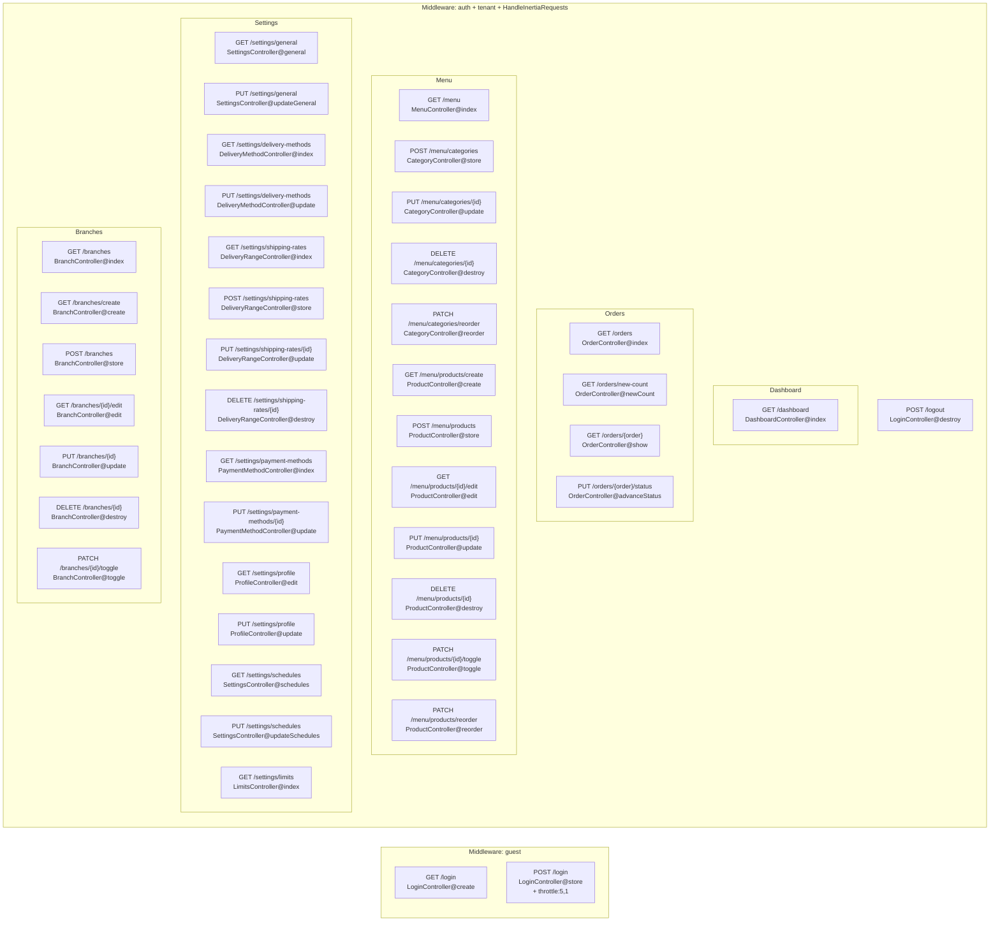

---

## 4. Mapa de Rutas — API Pública

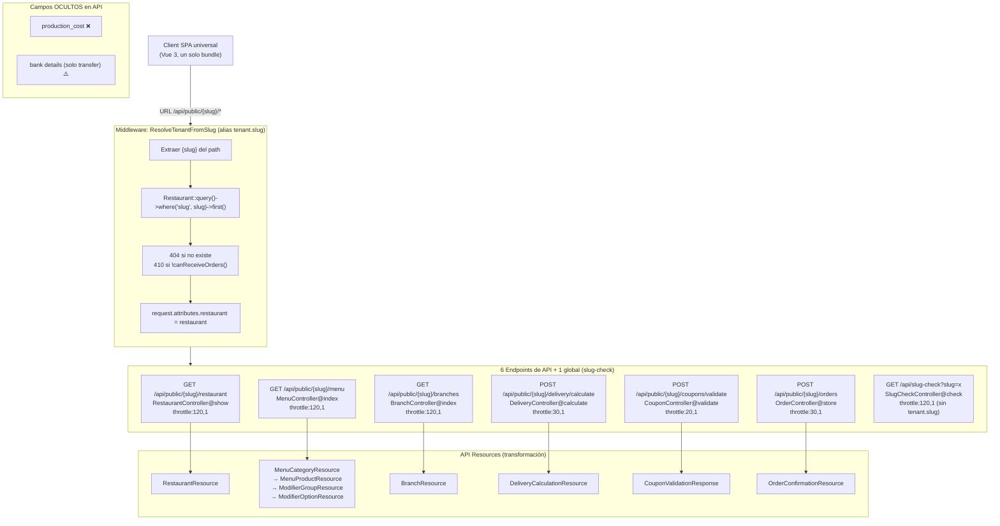

> **Nota (Abr 2026):** El patrón legacy por header `X-Restaurant-Token` + columna `restaurants.access_token` fue removido completo. La migración `2026_04_22_122940_drop_access_token_from_restaurants_table.php` eliminó la columna; el middleware `AuthenticateRestaurantToken` y sus rutas `/api/*` sin prefijo fueron borrados.

---

## 5. Mapa de Rutas — SuperAdmin

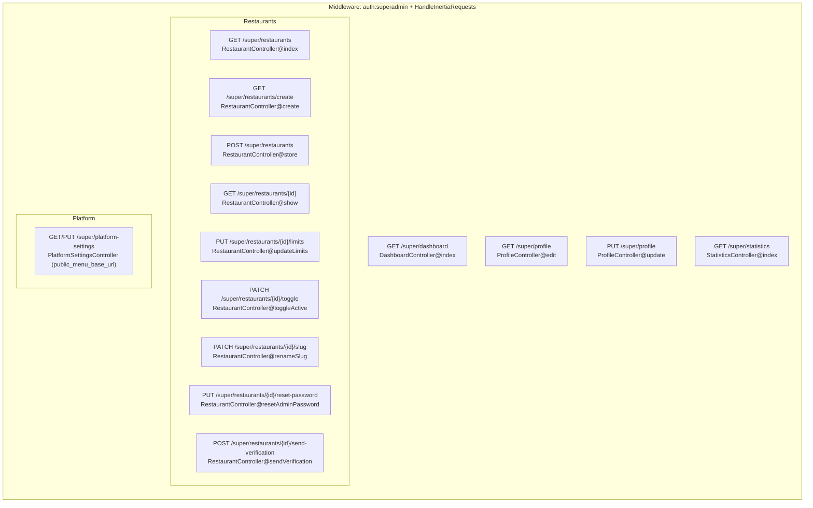

---

## 6. Ciclo de Vida de una Petición HTTP

### 6a. Petición Admin (Inertia)

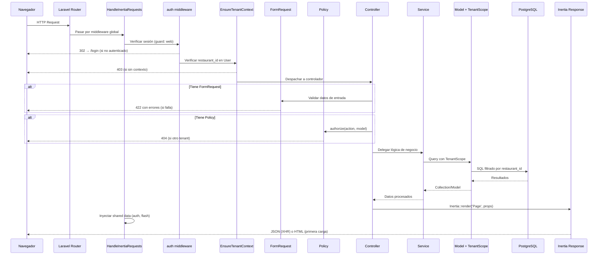

### 6b. Petición API Pública

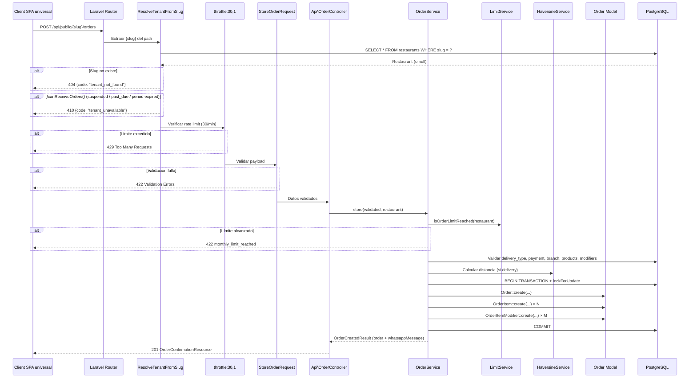

---

## 7. Flujo: Creación de Pedido (API)

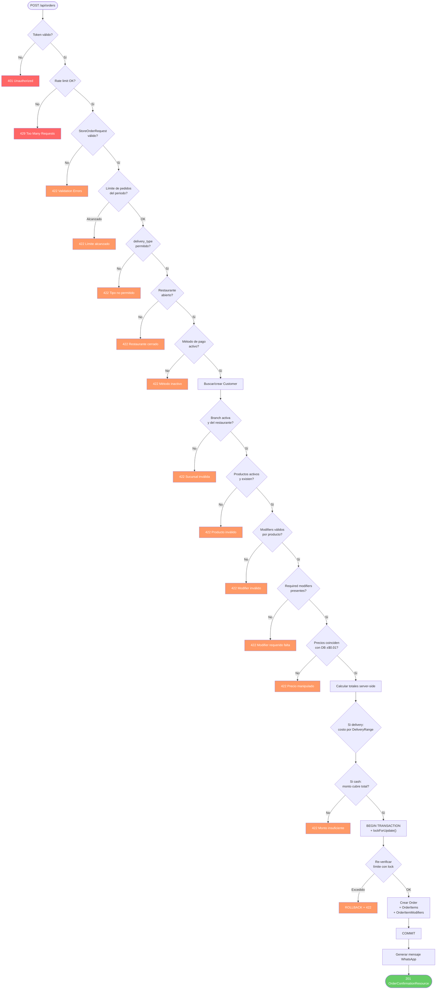

---

## 8. Flujo: Cálculo de Delivery

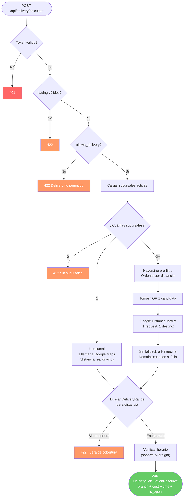

---

## 9. Flujo: Admin — Kanban de Pedidos

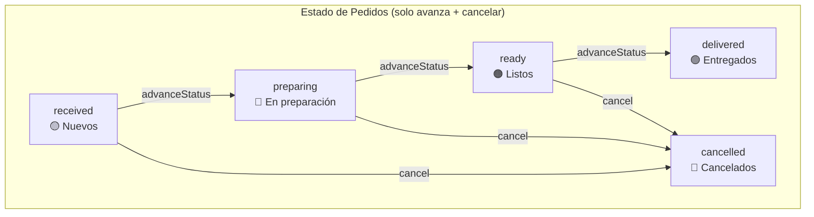

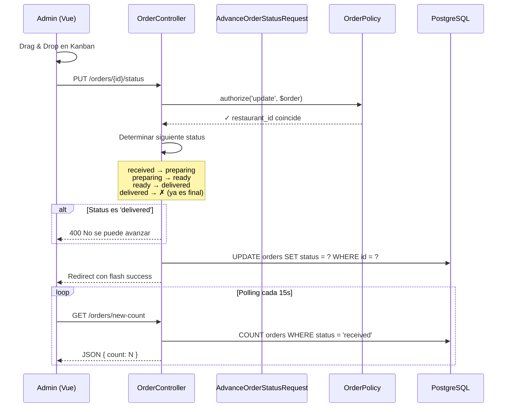

---

## 10. Capa de Servicios

```mermaid
graph TB
    subgraph OrderService["OrderService"]
        OS_STORE["store(validated, restaurant)"]
        OS_WA["buildWhatsAppMessage(order)"]
    end

    subgraph DeliveryService["DeliveryService"]
        DS_CALC["calculate(lat, lng, restaurant)"]
        DS_BUILD["buildResult(restaurant, branch, km, min)"]
        DS_SCHED["checkSchedule(restaurant)"]
    end

    subgraph LimitService["LimitService"]
        LS_REACH["isOrderLimitReached(restaurant)"]
        LS_COUNT["orderCountInPeriod(restaurant)"]
    end

    subgraph StatisticsService["StatisticsService"]
        SS_DASH["getDashboardData(restaurant, from, to)"]
        SS_ORD["ordersCount / preparingCount"]
        SS_REV["revenue / netProfit"]
        SS_BR["ordersByBranch"]
        SS_REC["recentOrders"]
    end

    subgraph HaversineService["HaversineService"]
        HS_DIST["distance(lat1, lon1, lat2, lon2)"]
    end

    subgraph GoogleMapsService["GoogleMapsService"]
        GS_DIST["getDistances(lat, lng, destinations)"]
    end

    OS_STORE -->|"verifica límite"| LS_REACH
    OS_STORE -->|"calcula distancia"| HS_DIST

    DS_CALC -->|"pre-filtra"| HS_DIST
    DS_CALC -->|"distancia real"| GS_DIST
    DS_CALC --> DS_BUILD
    DS_CALC --> DS_SCHED

    SS_DASH --> SS_ORD
    SS_DASH --> SS_REV
    SS_DASH --> SS_BR
    SS_DASH --> SS_REC
    SS_DASH -->|"cuenta periodo"| LS_COUNT

    GS_DIST -->|"HTTP"| GAPI["Google Maps API"]
```

---

## 11. Sistema de Multi-Tenancy

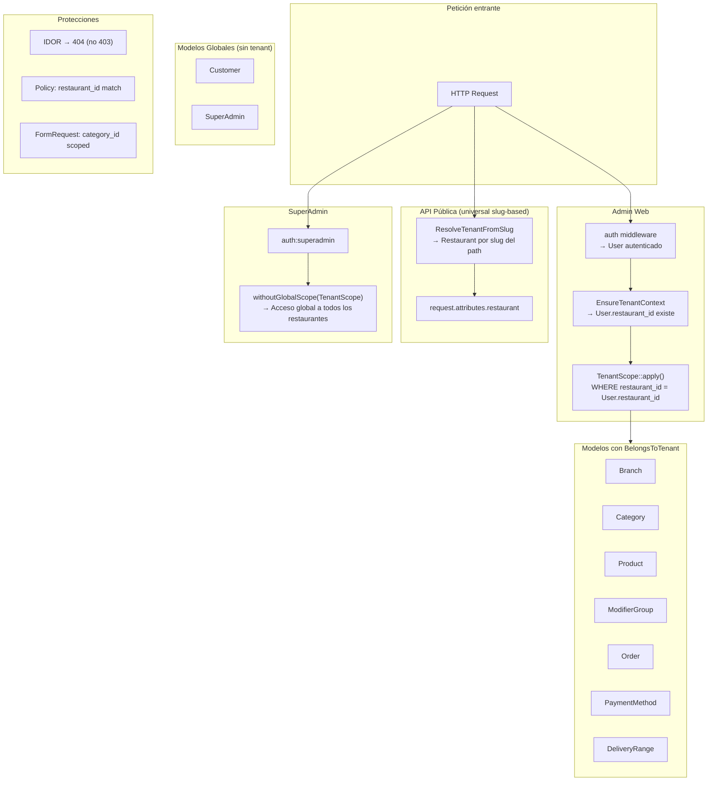

---

## 12. Middleware y Guards

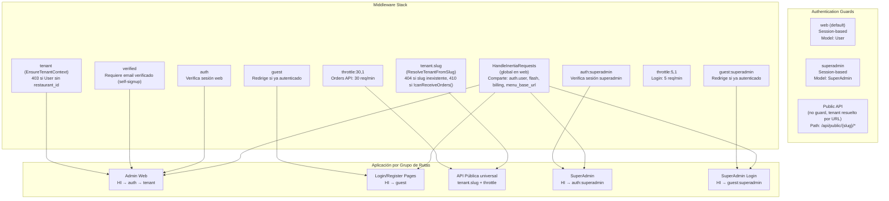

---

## 13. Descripción de Componentes

### Controllers

| Controlador | Responsabilidad | Modelos | Servicios |
|---|---|---|---|
| **LoginController** | Autenticación admin (login/logout) | User (vía Auth) | — |
| **DashboardController** | Métricas y KPIs del restaurante | Restaurant, Order | StatisticsService |
| **OrderController** (Web) | Kanban de pedidos, detalle, avance de status | Order, Branch | LimitService |
| **MenuController** | Listado de menú con categorías y productos | Category, Product | — |
| **CategoryController** | CRUD de categorías con imágenes y reorden | Category | — |
| **ProductController** | CRUD de productos con modifiers inline, imágenes, toggle | Product, Category, ModifierGroup, ModifierOption | — |
| **BranchController** | CRUD de sucursales con validación de última activa | Branch | — |
| **SettingsController** | Configuración general (nombre, logo, redes) y horarios | Restaurant, RestaurantSchedule | — |
| **DeliveryMethodController** | Activar/desactivar tipos de entrega | Restaurant, DeliveryRange | — |
| **DeliveryRangeController** | CRUD de tarifas de envío por rango de km | DeliveryRange | — |
| **PaymentMethodController** | Configuración de métodos de pago | PaymentMethod | — |
| **ProfileController** | Edición de perfil del admin | User | — |
| **LimitsController** | Vista de límites de pedidos del periodo | Restaurant, Branch | LimitService |
| **CancellationController** | KPIs y desglose de cancelaciones con filtros | Order, Branch | CancellationService |
| **MapController** | Mapa operativo con markers interactivos por pedido | Order, Branch | — |

### Controllers API

| Controlador | Responsabilidad | Modelos | Servicios | Resource |
|---|---|---|---|---|
| **Api\RestaurantController** | Info del restaurante (horarios, pagos, estado) | Restaurant | LimitService (vía Resource) | RestaurantResource |
| **Api\MenuController** | Menú público (sin production_cost) | Category, Product | — | MenuCategoryResource |
| **Api\BranchController** | Sucursales activas | Branch | — | BranchResource |
| **Api\DeliveryController** | Cálculo de costo/tiempo de envío | Restaurant, Branch | DeliveryService | DeliveryCalculationResource |
| **Api\OrderController** | Creación de pedidos | Order, Customer | OrderService | OrderConfirmationResource |

### Controllers SuperAdmin

| Controlador | Responsabilidad | Modelos | Servicios |
|---|---|---|---|
| **SuperAdmin\DashboardController** | Métricas globales cross-restaurant | Restaurant, Order | — |
| **SuperAdmin\RestaurantController** | Gestión completa de restaurantes, límites, tokens, passwords | Restaurant, User, Branch, PaymentMethod | LimitService |
| **SuperAdmin\ProfileController** | Perfil del SuperAdmin | SuperAdmin | — |
| **SuperAdmin\StatisticsController** | Estadísticas globales (30 días, top 10) | Order, Restaurant | — |

### Services

| Servicio | Responsabilidad | Dependencias |
|---|---|---|
| **OrderService** | Pipeline de 15 pasos para crear pedidos: validación, anti-tampering, transacción con lock, mensaje WhatsApp | LimitService, HaversineService |
| **DeliveryService** | Selección inteligente de sucursal y cálculo de costo. Optimiza llamadas a Google (0 para 1 sucursal, 1 para 2+) | HaversineService, GoogleMapsService |
| **LimitService** | Conteo de pedidos en periodo configurable por restaurante | — |
| **StatisticsService** | Agregaciones para dashboard: revenue, profit neto (incluye modifiers), pedidos por sucursal | LimitService |
| **HaversineService** | Distancia en km entre dos coordenadas (fórmula del gran círculo) | — |
| **GoogleMapsService** | Wrapper para Google Distance Matrix API (modo driving) | HTTP Client |
| **CancellationService** | KPIs de cancelaciones: tasa, motivo top, desglose por razón/sucursal/día | — |

### Policies (7)

Todas siguen el mismo patrón: verificar que `User.restaurant_id === Model.restaurant_id`.

- **OrderPolicy** — viewAny, view, update
- **BranchPolicy** — viewAny, view, create, update, delete
- **CategoryPolicy** — viewAny, view, create, update, delete
- **ProductPolicy** — viewAny, view, create, update, delete
- **ModifierGroupPolicy** — viewAny, view, create, update, delete
- **ModifierOptionPolicy** — viewAny, create, update (vía modifierGroup.restaurant_id), delete
- **DeliveryRangePolicy** — viewAny, create, update, delete
- **PaymentMethodPolicy** — viewAny, view, update

### Form Requests (22+)

| Área | Requests | Validaciones destacadas |
|---|---|---|
| **Pedidos API** | StoreOrderRequest | items max:50, qty max:100, modifier_option_id distinct, precios max:99999.99 |
| **Cancelación** | CancelOrderRequest | cancellation_reason required string |
| **Categorías** | Store/UpdateCategoryRequest | imagen mimes bloqueando SVG |
| **Productos** | Store/UpdateProductRequest | category_id scoped a restaurant (anti-IDOR), modifier groups inline |
| **Sucursales** | Store/UpdateBranchRequest | WhatsApp regex 10 dígitos |
| **Delivery** | StoreDeliveryRangeRequest, UpdateDeliveryRangeRequest | Validación de overlap entre rangos |
| **Delivery Methods** | UpdateDeliveryMethodsRequest | Requiere DeliveryRanges para activar delivery |
| **Pagos** | UpdatePaymentMethodRequest | Mínimo 1 activo, CLABE 16/18 dígitos, datos bancarios required para transfer |
| **General** | UpdateGeneralSettingsRequest | Logo mimes bloqueando SVG |
| **Horarios** | UpdateRestaurantScheduleRequest | Exactamente 7 días, formato HH:MM |
| **Perfil** | UpdateProfileRequest, UpdateSuperAdminProfileRequest | Validación de contraseña actual |
| **SuperAdmin** | CreateRestaurantRequest, UpdateRestaurantLimitsRequest, ResetAdminPasswordRequest | Slug regex, email unique, límite no menor a count actual |

### API Resources (10)

| Resource | Campos clave | Oculta |
|---|---|---|
| **RestaurantResource** | name, slug, is_open, delivery_methods, orders_limit_reached, branding colors, logo_url, today_schedule, closure_reason | — |
| **MenuCategoryResource** | name, image_url, products (nested) | — |
| **MenuProductResource** | name, price, image_url, modifier_groups (nested) | **production_cost** |
| **ModifierGroupResource** | name, selection_type, is_required, options (nested) | — |
| **ModifierOptionResource** | name, price_adjustment | **production_cost** |
| **BranchResource** | name, address, lat/lng, whatsapp | — |
| **DeliveryCalculationResource** | branch info, distance_km, duration_minutes, delivery_cost, is_open | — |
| **OrderConfirmationResource** | order_id, order_number (#NNNN), branch_whatsapp, whatsapp_message | — |
| **PaymentMethodResource** | type, label; bank details solo si type=transfer | bank details (otros tipos) |
| **RestaurantScheduleResource** | day_of_week, opens_at (HH:MM), closes_at (HH:MM), is_closed | — |

---

## Estadísticas del Backend

| Métrica | Valor |
|---|---|
| **Rutas totales** | 63 |
| **Controladores** | 24 |
| **Modelos Eloquent** | 15 |
| **Servicios** | 7 |
| **Form Requests** | 22+ |
| **Policies** | 7 (8 clases) |
| **API Resources** | 10 |
| **Middleware custom** | 3 |
| **Guards** | 2 (web, superadmin) + token custom |
| **DTOs** | 2 (OrderCreatedResult, DeliveryResult) |
| **Tests** | 149 (PHPUnit) |
